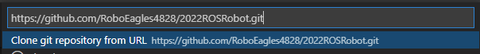

# 2022ROSRobot
ROS Robot code for the 2022 season. 

## Windows 11 Install
Execute the following commands from command line. You will restart several times throught this process.
1. Install VS Code \
`winget install -e --id Microsoft.VisualStudioCode`

2. Install Docker \
`winget install -e --id Docker.DockerDesktop` \
**NOTE**: Docker will ask to update WSL2 kernal, here is the [installer](https://wslstorestorage.blob.core.windows.net/wslblob/wsl_update_x64.msi) \

3. Set default WSL version to WSL2 \
`wsl --set-default-version 2`

4. Install Ubuntu WSL \
`winget install -e --id Canonical.Ubuntu`

5. Search for and open Ubuntu to finish install. (Press enter if it appears the terminal isn't doing anything)

6. Make Ubuntu your default WSL Distro by running this in windows terminal \
`wsl -s Ubuntu` \
then open Docker Desktop
Settings -> Resources -> WSL Integration -> Enable and make sure Ubuntu is enabled -> Apply & Restart

7. Install GPU driver for WSLg \
[Intel GPU](https://downloadcenter.intel.com/download/30579/Intel-Graphics-Windows-DCH-Drivers) \
[NVIDIA GPU](https://developer.nvidia.com/cuda/wsl) \
[AMD GPU](https://community.amd.com/t5/radeon-pro-graphics/announcing-amd-support-for-gpu-accelerated-machine-learning/ba-p/414185)

8. Update WSL by opening terminal as administrator and execute: \
`wsl --update` \
`wsl --shutdown`

9. (*Optional*) Test to make sure WSLg is installed. \
    Open Ubuntu and Excute the following: \
    `sudo apt update && sudo apt install -y xterm` \
    `xterm` \
    A window that looks like a terminal should appear. \

10. Open VS Code and install the Remote Development extension \

11. In VS Code go to settings -> Extensions -> Remote - Containers -> Hit the check box to turn on `Execute in WSL`

12. Press F1 to bring up the command palette and use the command: \
`Remote-Containers: Clone Repository in Container Volume..` \

13. Paste the git link for this repo: \
`https://github.com/RoboEagles4828/2022ROSRobot.git` \
And press enter \

14. The developement container will start to open, click on the notification in the bottom right to see progress.

15. When you are fully in the container, File -> Save Workspace As.. -> Show local -> Name the file and Save

16. Test that gazebo works by executing `gazebo` in the terminal

## Ubuntu Install

1. Install VS Code
https://code.visualstudio.com/download (Click the big blue .deb button right under the Linux penguin)

2. Install Docker Engine (docker but without desktop app capabilities)
https://docs.docker.com/engine/install/ubuntu/

3. Go to your terminal by clicking "Show Applications" and selecting it, or Ctrl+Alt+T. In the terminal, run this command:
xauth generate :0 . trusted

4. Make sure you're logged into Git -> to do this, go to terminal, type

git config --global user.name "Your Name"
git config --global user.email "your.github.email.address@gmail.com"

5. Open VS Code and install Remote Containers extension from the Extensions menu on the left

6. Press F1 to bring up the command palette (fn+F1 on Mac)
 - Type 'Remote-Containers: Clone Repository in Container Volume'
 - Paste the HTTPS link to this repository, https://github.com/RoboEagles4828/2022ROSRobot.git, into the field
 
7. Click "show log" on the notification that pops up. Click "Trust Folder" if you need to

8. Once the install has finished, you can open a new terminal window with the plus sign on the bottom terminal window, or go to Terminal -> New Terminal in the top toolbar. Here, just type gazebo into the command line, press enter, and watch the magic unfold!

9. Save the workspace by going to File -> Save Workspace As -> Show local -> Desktop

Done! 

## Debugging Containers

**Nuke Option**: If you feel like you messed something up, your container does not start anymore, or you keep getting errors opening your workspace and you want to start from scratch then open docker desktop and delete all of you contianers, images and volumes.